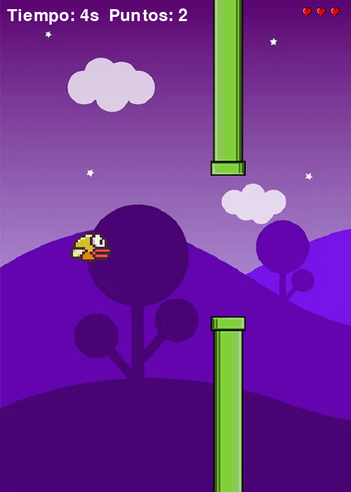
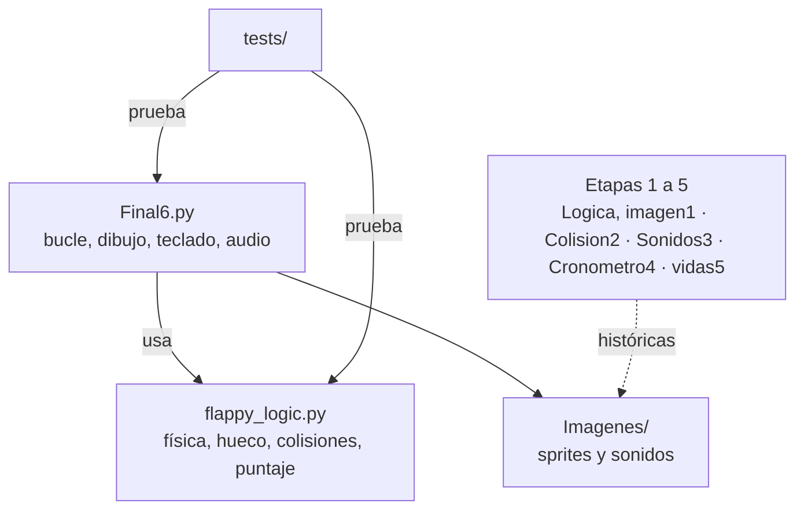

<div align="center">
  
  <h1>SkyFlap</h1>
  <p><b>Flappy Bird en Python y pygame, construido paso a paso como ejercicio de aprendizaje.</b></p>
  
  
  
  
  
  <p>
    <a href="#-inicio-rápido">Inicio rápido</a> ·
    <a href="#-características">Características</a> ·
    <a href="#-arquitectura">Arquitectura</a> ·
    <a href="#-pruebas">Pruebas</a> ·
    <a href="#-lo-que-todavía-no-existe">Limitaciones</a>
  </p>
</div>

SkyFlap es una recreación de Flappy Bird para escritorio. El repositorio conserva las etapas intermedias del desarrollo (`Logica, imagen1.py` a `vidas5.py`) y una versión final jugable, `Final6.py`, que usa una lógica pura y probada en `flappy_logic.py`. Es un proyecto de aprendizaje: no es un juego pulido ni tiene reinicio, menús ni puntuación guardada.

## 🎬 Vista rápida

<div align="center">
  
</div>

> Fotograma compuesto con los sprites reales del repositorio y las funciones de `flappy_logic.py` (posición de tubos y hueco), generado en modo headless; no es una grabación del bucle de juego.

## ✨ Características

| Característica | Detalle |
|---|---|
| Control | `Espacio` hace saltar al pájaro; cerrar la ventana sale |
| Física | Gravedad y amortiguación independientes de los FPS (`dt` acotado a 50 ms) |
| Tubos | Un tubo a la vez, de derecha a izquierda; hueco fijo de 200 px con altura aleatoria |
| Vidas | 3 vidas; cada tubo golpeado y cada contacto con techo o suelo cuesta una |
| Puntaje | 1 punto por tubo superado; cronómetro, puntos y corazones en pantalla |
| Audio | Salto, colisión, paso de obstáculo y música; sin dispositivo de audio corre en silencio |

## 🏗️ Arquitectura



`flappy_logic.py` no depende de pygame, por eso se puede probar sin abrir ventana.

## 🚀 Inicio rápido

| Requisito | Versión |
|---|---|
| Python | 3.9 o superior |
| pygame-ce | 2.5 o superior (`requirements.txt`) |

```bash
pip install -r requirements.txt
python Final6.py
```

Ejecuta siempre desde la raíz del repositorio (las etapas 1 a 5 dependen del directorio de trabajo).

<details>
<summary>Etapas del desarrollo y estructura</summary>

| Archivo | Contenido |
|---|---|
| `Logica, imagen1.py` | Física básica, tubos e imágenes |
| `Colision2.py` | Detección de colisión |
| `Sonidos3.py` | Sonidos y música |
| `Cronometro4.py` | Cronómetro en pantalla |
| `vidas5.py` | Sistema de vidas |
| `Final6.py` | Versión final, usa `flappy_logic.py` |

Las etapas 1 a 5 se dejan tal cual y conservan los errores de la versión original.

```text
SkyFlap/
├── Final6.py · flappy_logic.py
├── (etapas 1 a 5).py
├── Imagenes/            # sprites y Sonidos/
├── tests/               # test_logica.py, test_audio_y_rutas.py
├── requirements.txt · requirements-dev.txt
└── .github/workflows/ci.yml
```

</details>

## 🧪 Pruebas

```bash
pip install -r requirements-dev.txt
python -m pytest
```

Son **15 tests** (comprobados: 15 pasan): cubren la lógica pura y la carga de recursos. En un entorno sin pantalla ni audio: `SDL_VIDEODRIVER=dummy SDL_AUDIODRIVER=dummy python -m pytest`. GitHub Actions lo ejecuta en cada push a `main` y en cada pull request. El bucle gráfico no se prueba automáticamente.

## 🚧 Lo que todavía no existe

- Varios fondos (`FondoAmarillo`, `FondoNormal`, `FondoRojo`), pájaros alternativos y `Restart.png` están en `Imagenes/`, pero el código no los usa: no hay selección de escenario ni de pájaro, ni pantalla de reinicio. Al terminar, el juego se cierra.
- Sin puntuación máxima persistente: el puntaje final solo se imprime en consola.
- Solo un tubo en pantalla a la vez.
- Los saltos se suman a la velocidad actual (comportamiento original): pulsar muy rápido acumula impulso.
- Colisiones por rectángulos del tamaño del sprite, no pixel-perfect.
- `FondoNormal.mp3` y `FondoVioleta.mp3` no se usan; siempre suena `FondoAmarillo.mp3`.

## 📄 Licencia

Sin licencia definida: todos los derechos reservados por defecto. Las imágenes y sonidos tampoco declaran origen ni licencia.

<div align="center"><sub>Hecho por Luiss2080 · Python + pygame</sub></div>
